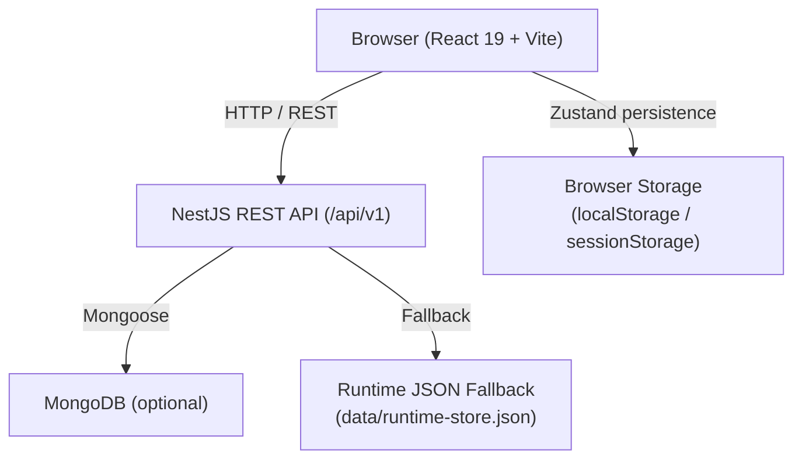

# PromptForge — Project Analysis

## Purpose

PromptForge is an AI discovery and prompt-engineering platform. It lets users:

- **Build prompts** through a guided conversational flow, then run them in a live chat
- **Browse and compare AI models** from a curated marketplace (GPT-5, Claude, Gemini, Llama, DeepSeek, and 20+ more)
- **Create and deploy AI agents** with configurable system prompts, tone, memory, and deployment targets
- **Discover** AI research and engage in follow-up discussion threads

It supports both **guest sessions** (no login required) and **authenticated accounts**, with seamless data merging on login.

---

## Architecture Overview

The backend has **two persistence modes**:
1. **MongoDB** mode — when `MONGODB_URI` is set
2. **Runtime fallback** mode — a local JSON file store used for development and demo environments

---

## Tech Stack

| Layer | Technology |
|---|---|
| Frontend framework | React 19 + Vite |
| Frontend state | Zustand |
| Frontend routing | React Router DOM v7 |
| Frontend HTTP | Axios |
| UI styling | TailwindCSS v4 |
| Animations | Framer Motion |
| Icons | Lucide React |
| Virtualization | React Window |
| Backend framework | NestJS 11 (TypeScript) |
| Auth | JWT (access + refresh), Passport.js |
| ORM / ODM | Mongoose (optional) |
| Password hashing | bcryptjs |
| File extraction | pdf-parse, mammoth, word-extractor |
| Cron / scheduling | NestJS Schedule |
| Deployment (frontend) | Vercel |
| Deployment (backend) | Railway |

---

## Key Features

### Chat Hub
- Real-time-style conversation with AI model selection per message
- File uploads (PDF, DOCX, TXT) with text extraction and chunking
- Model switching mid-conversation with system message injection
- Guest and authenticated sessions, both persisted

### Prompt Builder
- 5-step conversational flow: use case → audience → experience → follow-up → result
- Template interpolation with {{variable}} syntax
- Token estimation and model recommendations from backend
- Edit, regenerate, delete, and hand-off to chat

### Model Marketplace
- 27+ seeded models filterable by category, lab, price, rating, license
- Compare up to N models side-by-side
- Per-model "How to Use" guide with Python starter code
- Model recommendation algorithm based on use case + speed + cost + rating

### Agent Builder
- Template-driven or blank creation
- Configurable: system prompt, tone, audience, tools, memory type, deploy target
- Simulated preview responses with latency/satisfaction metrics
- Draft → Live lifecycle

### Discover
- Research feed with topic filters
- Discussion flow (`/discover/discuss`)

---

## Architectural Observations & Recommendations

### Issues

1. **Simulated AI responses** — The chat and agent modules return hardcoded/template-based responses. There is no real LLM API integration. This must be connected to OpenAI, Anthropic, or another provider before production use.

2. **Token estimation is naive** — `text.length / 4` is a rough proxy. Actual token counts vary significantly by model tokenizer. Consider using `tiktoken` (OpenAI) or model-specific libraries.

3. **No real-time streaming** — Chat responses are returned as a single payload. Users expect streaming for long responses. WebSockets or SSE should be added.

4. **Runtime store not production-safe** — The JSON fallback writes to disk and has no concurrency control, TTL enforcement at scale, or multi-instance support.

5. **No rate limiting or quota enforcement** — Auth endpoints and chat endpoints are unprotected against abuse.

6. **Agent simulation only** — The `/agents/{id}/respond` endpoint returns canned responses, not real agent execution.

### Opportunities

- Integrate a real LLM SDK (Anthropic, OpenAI) behind the chat and agent services
- Add SSE or WebSocket streaming to `ChatService`
- Replace or supplement runtime store with Redis for scalable session caching
- Add request rate limiting (`@nestjs/throttler`)
- Add proper tokenization library
- Expose prompt template management as an admin UI
