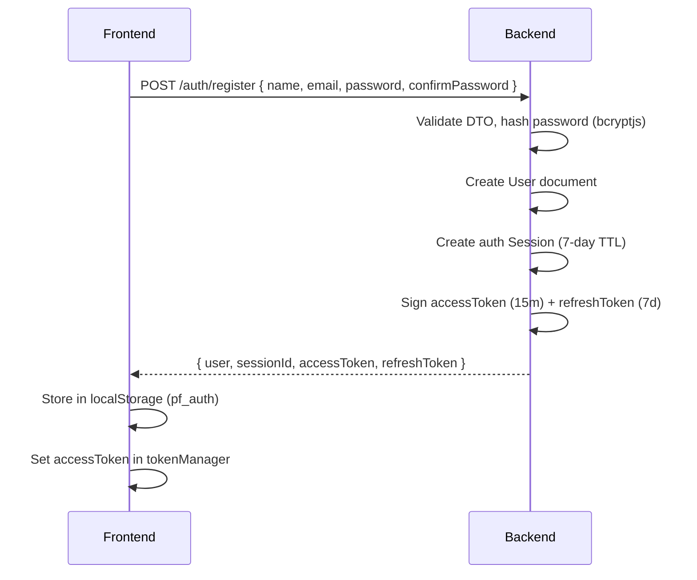
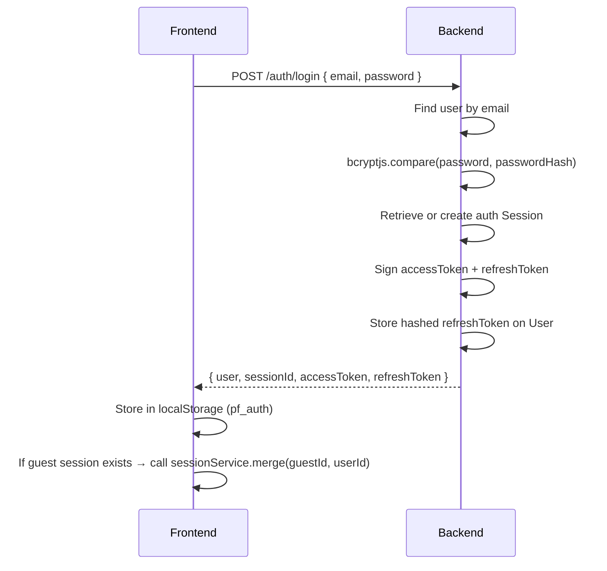
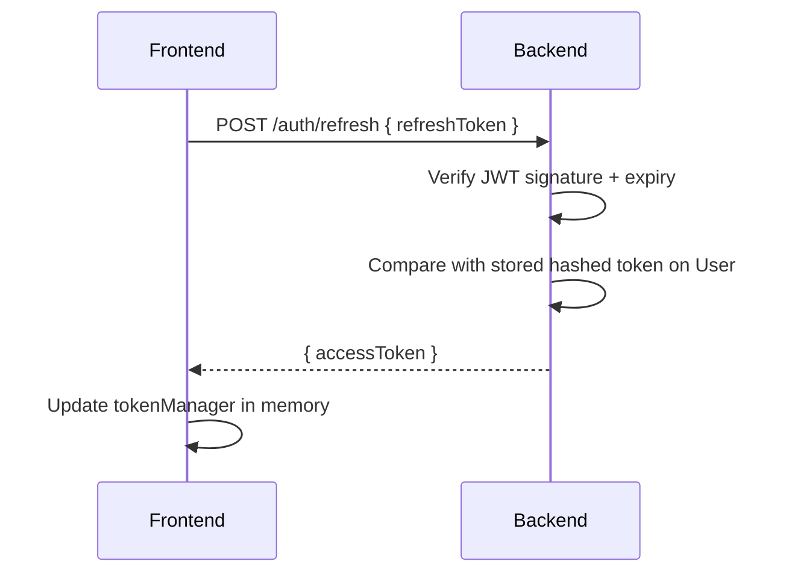
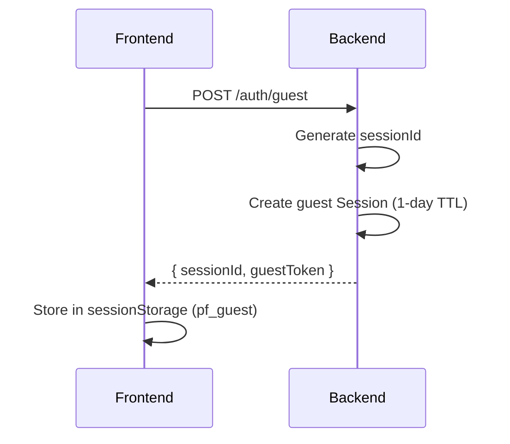
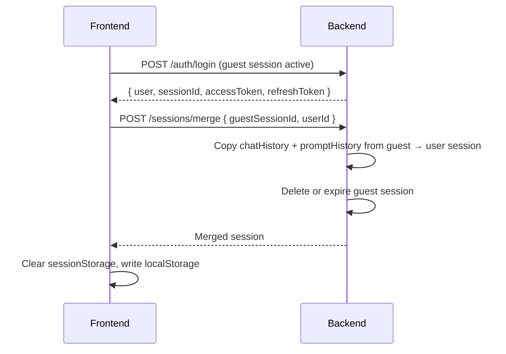

# Authentication & Authorization

PromptForge uses a **dual-token JWT strategy** with support for both authenticated users and anonymous guest sessions.

---

## Token Strategy

| Token | Lifetime | Storage |
|---|---|---|
| Access token | 15 minutes | Memory (`tokenManager.js`), also sent in response |
| Refresh token | 7 days | `localStorage` (user) / `sessionStorage` (guest) |

The access token is short-lived intentionally. The refresh token is stored persistently and used to renew access silently.

---

## Auth Flow Diagrams

### Registration



### Login



### Token Refresh



### Guest Session



### Guest → Authenticated (Session Merge)



---

## Session Bootstrap (Frontend)

`useSession.js` runs once on app mount:

```
1. Check localStorage for pf_auth
2. If found:
   a. Call GET /auth/me to verify
   b. If 401 → call POST /auth/refresh
   c. If refresh fails → clear auth, fall through to guest
3. If no auth:
   a. Check sessionStorage for pf_guest
   b. If found → validate and reuse
   c. If not found → POST /auth/guest
4. Hydrate chatStore + promptStore from session data
5. Set hasBootstrapped: true
```

---

## Guards

### JwtAuthGuard (global)

Applied globally in `app.module.ts`. Verifies the `Authorization: Bearer` header on every request **except** those decorated with `@Public()`.

Public endpoints:
- `POST /auth/register`
- `POST /auth/login`
- `POST /auth/refresh`
- `POST /auth/guest`
- `GET /health`
- `GET /models` and model read endpoints
- `GET /discover/*`

### OptionalJwtGuard

Used on endpoints that serve both guests and authenticated users (e.g. `/chat/message`, `/prompts/generate`). Extracts user from JWT if present, otherwise sets `req.user = null`.

---

## Password Security

- Hashed with `bcryptjs` (default salt rounds: 10)
- `passwordHash` field has `select: false` — never returned in user queries
- Refresh tokens are hashed before storage; compared with `bcryptjs.compare` on use

---

## Role-Based Access

| Role | Description |
|---|---|
| `user` | Default for all registered users |
| `admin` | Reserved; no admin-specific endpoints implemented yet |

The `role` field exists on the User schema and in the JWT payload. Admin guards can be added per-endpoint when needed.

---

## Logout

1. Frontend calls `POST /auth/logout` (requires valid JWT)
2. Backend clears `refreshToken` on the User document
3. Frontend clears `localStorage` (`pf_auth`) and in-memory `tokenManager`
4. Optionally re-initializes a guest session

---

## Security Considerations

- Access tokens are short-lived (15 min) to limit blast radius if leaked
- Refresh tokens are hashed at rest
- `HttpOnly` cookies can be used instead of body tokens (configurable via `NODE_ENV`)
- No rate limiting on auth endpoints — **this should be added before production** (see [security.md](security.md))
