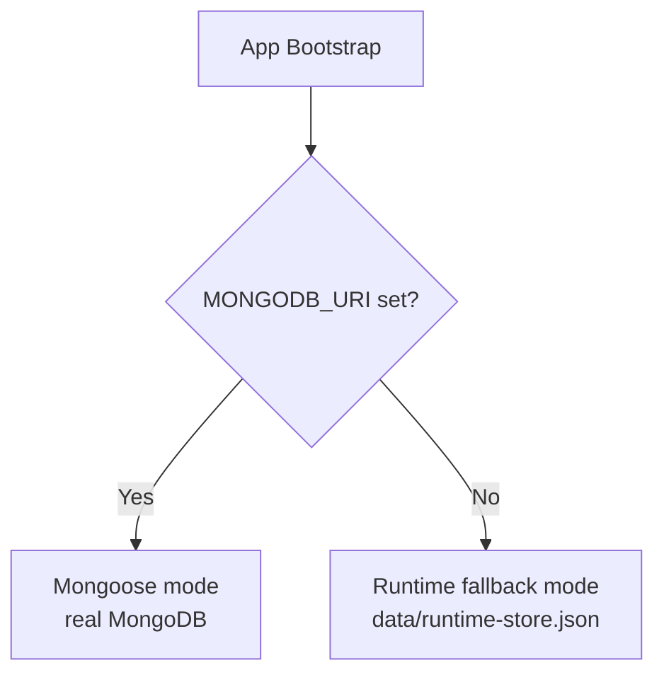

# Backend Architecture

**Location:** `promptforge-server/`  
**Stack:** NestJS 11, TypeScript, JWT + Passport.js, Mongoose (optional), bcryptjs, NestJS Schedule

---

## Entry Point

```
src/main.ts           → bootstrap, CORS, global prefix /api/v1, validation pipe,
                        exception filter, logging interceptor
src/app.module.ts     → module graph, conditional Mongoose wiring
```

---

## Module Map

```
src/
  auth/          → register, login, logout, refresh, guest, me
  users/         → user CRUD, refresh token management
  sessions/      → session lifecycle, merge, cron cleanup
  chat/          → message handling, file uploads, model switching
  prompts/       → prompt generation, history, regenerate/edit/delete
  models/        → model listing, filtering, recommendations, comparison
  agents/        → agent CRUD, templates, simulate response
  tokens/        → token usage stats per session/user
  discover/      → research feed and filters
  runtime/       → local JSON fallback persistence
  database/      → seed logic (models, templates, agents)
  data/          → seeded datasets (models, prompt templates, agent templates)
  types/         → local type declarations for untyped packages
  common/        → decorators, guards, filters, interceptors
  health.controller.ts → GET /health
```

---

## Persistence Mode

The app detects persistence mode at startup:



- **Mongoose mode**: Full schema-backed persistence with all indexes
- **Runtime fallback**: In-memory store + JSON file at `data/runtime-store.json`; auto-loads on start, auto-saves on writes; handles JSON corruption with timestamped quarantine backups

---

## Auth Module (`src/auth/`)

### Controller Endpoints

| Method | Path | Auth | Description |
|---|---|---|---|
| POST | `/auth/register` | Public | Create user account |
| POST | `/auth/login` | Public | Email/password login |
| POST | `/auth/refresh` | Public | Refresh access token |
| POST | `/auth/logout` | JWT required | Invalidate refresh token |
| POST | `/auth/guest` | Public | Create guest session |
| GET | `/auth/me` | JWT required | Get current user profile |

See [auth.md](auth.md) for the full flow.

---

## Users Module (`src/users/`)

Handles user records and token stat tracking. Not directly exposed via HTTP — used internally by `AuthService` and `SessionsService`.

Key operations: `findByEmail`, `findById`, `create`, `updateRefreshToken`, `incrementTokenStats`.

---

## Sessions Module (`src/sessions/`)

Manages session lifecycle for both guests and authenticated users.

Key operations:
- `createGuestSession(sessionId)` — 1-day TTL
- `createAuthSession(userId)` — 7-day TTL
- `merge(guestSessionId, userId)` — copies chat and prompt history into the user's session
- `addMessage(sessionId, message)` — appends to chat history
- `addPrompt(sessionId, prompt)` — appends to prompt history

**Cron job** runs hourly to delete expired sessions.

---

## Chat Module (`src/chat/`)

### Endpoints

| Method | Path | Description |
|---|---|---|
| POST | `/chat/message` | Send a message (text + optional files) |
| POST | `/chat/switch-model` | Change active model for session |
| GET | `/chat/history` | Get message history for session |
| DELETE | `/chat/history` | Clear history for session |

### File Upload Support

- Up to 20 files, 150 MB total per request
- `ChatFileExtractor` handles: PDF (`pdf-parse`), DOCX (`mammoth`, `word-extractor`), TXT
- Large files are chunked; unsupported formats get a warning note in the response
- Sends multipart `FormData` only when files are attached

### Response Generation

Currently **simulated** — `ChatService.generateResponse()` returns template-based strings. No real LLM API call is made. See [analyze.md](analyze.md) for the production gap.

---

## Prompts Module (`src/prompts/`)

### Endpoints

| Method | Path | Description |
|---|---|---|
| POST | `/prompts/generate` | Generate from questionnaire answers |
| POST | `/prompts/regenerate` | Regenerate or refine existing prompt |
| PUT | `/prompts/:promptId` | Edit prompt text |
| GET | `/prompts/history` | List prompts for session |
| DELETE | `/prompts/:promptId` | Remove prompt |

### Generation Logic

1. Match answers to a `PromptTemplate` by `useCase`
2. Interpolate `{{variable}}` placeholders with answer values
3. Append experience-level instructions and audience framing
4. Estimate tokens: `text.length / 4`
5. Extract `suggestedModels` from template
6. Persist to session's `promptHistory`

---

## Models Module (`src/models/`)

### Endpoints

| Method | Path | Description |
|---|---|---|
| GET | `/models` | Paginated list with filters |
| GET | `/models/:modelId` | Single model with "How to Use" guide |
| GET | `/models/labs` | Labs with model counts |
| GET | `/models/trending` | Trending models |
| GET | `/models/featured` | Featured models |
| POST | `/models/recommend` | Recommendation algorithm |
| GET | `/models/compare` | Compare multiple models by IDs |

27 models seeded: GPT-5, GPT-4o, Claude Opus/Sonnet/Haiku, Gemini 2.0/1.5, Llama 3.3, Mistral, DeepSeek V3/R1, Grok 3, Codestral, and more.

**Recommendation algorithm**: scores models by use-case match + normalized price + speed weight + rating.

---

## Agents Module (`src/agents/`)

### Endpoints

| Method | Path | Description |
|---|---|---|
| GET | `/agents/templates` | List agent templates |
| POST | `/agents` | Create agent |
| GET | `/agents` | List agents (by session or user) |
| GET | `/agents/:id` | Get agent |
| PUT | `/agents/:id` | Update agent |
| POST | `/agents/:id/respond` | Simulate agent response |
| DELETE | `/agents/:id` | Delete agent |

On create: auto-generates a `greeting` and `summary` from name + system prompt.  
On `respond`: simulates latency, updates satisfaction/quality metrics, returns a canned response.

---

## Tokens Module (`src/tokens/`)

Tracks token usage per session and per user.

- `GET /tokens/session/:sessionId` → stats, totals, breakdown by agent
- `GET /tokens/user/:userId` → lifetime stats

Estimation: `tokens = text.length / 4`. Cost: `(tokens / 1_000_000) * outputPricePer1M`.

---

## Discover Module (`src/discover/`)

- `GET /discover/filters` → available topic filters
- `GET /discover/feed?filter=topic` → filtered feed items
- `GET /discover/feed/:id` → single item

---

## Common Infrastructure

### Decorators

```typescript
@Public()           // Skip JwtAuthGuard for this endpoint
@CurrentUser()      // Extract user from JWT payload in controller param
```

### Guards

```typescript
JwtAuthGuard        // Verify JWT; applied globally; respects @Public()
OptionalJwtGuard    // JWT optional — falls back to guest context
```

### Filters

```typescript
GlobalExceptionFilter   // Catches all exceptions, returns structured { statusCode, message, timestamp }
```

### Interceptors

```typescript
LoggingInterceptor      // Logs method, path, status, duration for every request
TransformInterceptor    // Wraps all responses in { data, statusCode, timestamp }
```

---

## Commands

```bash
cd promptforge-server

npm run start:dev     # Development with hot reload
npm run build         # Compile to dist/
npm run start:prod    # Run compiled build
npm run seed          # Seed models, templates, agents
npm run test          # Unit tests
```
