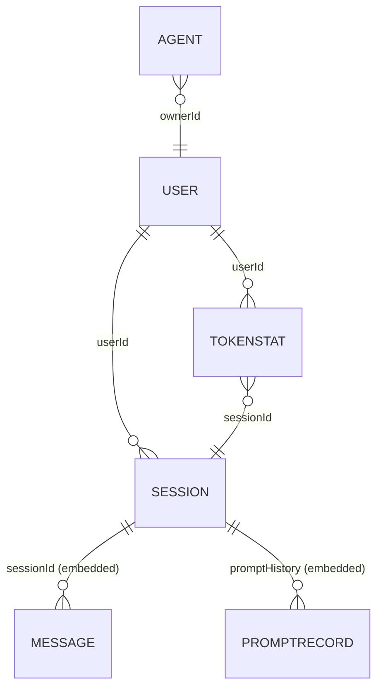

# Database Schema

PromptForge uses **MongoDB + Mongoose** when `MONGODB_URI` is configured. When it is not, the runtime fallback store replicates the same logical structure in a local JSON file.

---

## Collections Overview



---

## User

**Collection:** `users`

| Field | Type | Constraints | Notes |
|---|---|---|---|
| `_id` | ObjectId | PK | |
| `name` | String | Required, unique | Display name |
| `email` | String | Required, unique, lowercase | |
| `passwordHash` | String | Required, select: false | Never returned in queries by default |
| `role` | Enum | `user` \| `admin`, default `user` | |
| `preferences.defaultModel` | String | Optional | User's preferred model |
| `preferences.theme` | String | Default `dark` | |
| `preferences.language` | String | Default `en` | |
| `tokenStats.totalUsed` | Number | Default 0 | Lifetime tokens |
| `tokenStats.totalCost` | Number | Default 0 | Lifetime cost (USD) |
| `refreshToken` | String | Nullable | Hashed refresh token |
| `createdAt` | Date | Auto | |
| `updatedAt` | Date | Auto | |

**Indexes:** `email` (unique), `name` (unique)

---

## Session

**Collection:** `sessions`

| Field | Type | Constraints | Notes |
|---|---|---|---|
| `_id` | ObjectId | PK | |
| `sessionId` | String | Required, unique | Frontend-generated ID |
| `userId` | ObjectId | Nullable, ref: User | Null for guests |
| `isGuest` | Boolean | Required | |
| `chatHistory` | Array | Embedded | See ChatMessage sub-schema |
| `promptHistory` | Array | Embedded | See PromptRecord sub-schema |
| `activeModel` | String | Nullable | Current active model |
| `modelHistory` | String[] | Default `[]` | Models used in session |
| `expiresAt` | Date | Required | 1 day (guest), 7 days (auth) |
| `createdAt` | Date | Auto | |

**Indexes:** `sessionId` (unique), `expiresAt` (TTL via cron)

### ChatMessage (embedded in `chatHistory`)

| Field | Type | Notes |
|---|---|---|
| `role` | String | `user` or `assistant` |
| `content` | String | Message text |
| `modelId` | String | Model used |
| `tokens` | Number | Estimated tokens |
| `timestamp` | Date | |

### PromptRecord (embedded in `promptHistory`)

| Field | Type | Notes |
|---|---|---|
| `promptText` | String | Generated prompt text |
| `modelRecommendations` | String[] | Suggested model IDs |
| `answers` | Object | Original questionnaire answers |
| `createdAt` | Date | |

---

## Message

**Collection:** `messages` (also used as a standalone document when needed)

| Field | Type | Constraints |
|---|---|---|
| `_id` | ObjectId | PK |
| `sessionId` | String | Required |
| `role` | String | Required (`user` / `assistant`) |
| `content` | String | Required |
| `modelId` | String | Required |
| `tokens` | Number | Required |
| `timestamp` | Date | Auto |

**Index:** `sessionId`

---

## PromptTemplate

**Collection:** `prompttemplates`

| Field | Type | Notes |
|---|---|---|
| `_id` | ObjectId | PK |
| `templateId` | String | Unique identifier |
| `title` | String | Display name |
| `category` | String | e.g. `write_content`, `build_something` |
| `useCase` | String | Maps to answer.useCase |
| `audienceLevel` | String | `beginner`, `intermediate`, `advanced` |
| `systemPrompt` | String | Injected as system message |
| `userPromptTemplate` | String | `{{variable}}` interpolation source |
| `tags` | String[] | |
| `suggestedModels` | String[] | Default recommendations |

**Index:** `templateId` (unique)

---

## Agent

**Collection:** `agents`

| Field | Type | Notes |
|---|---|---|
| `_id` | ObjectId | PK |
| `id` | String | Application-level UUID |
| `ownerId` | String | User ID or session ID |
| `name` | String | Required |
| `templateId` | String | Optional; source template |
| `modelId` | String | Required |
| `systemPrompt` | String | Required |
| `description` | String | Optional |
| `agentType` | String | Optional |
| `mainJob` | String | Optional |
| `audience` | String | Optional |
| `tone` | String | Optional |
| `avoid` | String | Optional |
| `notes` | String | Optional |
| `tools` | String[] | Default `[]` |
| `memoryType` | String | Default `none` |
| `status` | Enum | `draft` \| `live`, default `draft` |
| `deployTarget` | String | Default `api-endpoint` |
| `summary` | String | Auto-generated |
| `greeting` | String | Auto-generated |
| `metrics` | Object | `{ avgLatency, satisfaction, quality }` |
| `previewMessages` | Array | Simulated preview conversation |
| `createdAt` | Date | Auto |
| `updatedAt` | Date | Auto |

---

## ModelEntity

**Collection:** `models`

| Field | Type | Notes |
|---|---|---|
| `_id` | ObjectId | PK |
| `modelId` | String | Unique (e.g. `gpt-4o`) |
| `name` | String | Display name |
| `lab` | String | Provider (e.g. `OpenAI`) |
| `labIcon` | String | Icon identifier |
| `category` | String[] | `language`, `vision`, `code`, etc. |
| `contextWindow` | Number | Tokens |
| `inputPricePer1M` | Number | USD per 1M input tokens |
| `outputPricePer1M` | Number | USD per 1M output tokens |
| `isFree` | Boolean | |
| `isOpenSource` | Boolean | |
| `license` | String | Default `Commercial` |
| `multimodal` | Boolean | |
| `speed` | Enum | `fast` \| `medium` \| `slow` |
| `bestFor` | String[] | Use case tags |
| `rating` | Number | 0–5 |
| `reviewCount` | Number | |
| `description` | String | |
| `useCases` | String[] | |
| `benchmarks` | Object | `{ MMLU, HumanEval, MATH }` |
| `tags` | String[] | |
| `isLive` | Boolean | Default `true` |
| `isFeatured` | Boolean | |
| `isTrending` | Boolean | |

**Index:** `modelId` (unique)

---

## TokenStat

**Collection:** `tokenstats`

| Field | Type | Notes |
|---|---|---|
| `_id` | ObjectId | PK |
| `sessionId` | String | Required |
| `userId` | String | Nullable |
| `agentName` | String | Required |
| `actionType` | String | e.g. `chat`, `prompt-generate` |
| `inputTokens` | Number | Required |
| `outputTokens` | Number | Required |
| `totalTokens` | Number | Computed: input + output |
| `estimatedCostUSD` | Number | Computed via model pricing |
| `modelId` | String | Required |
| `timestamp` | Date | Required |

**Index:** `sessionId`, `userId`

---

## Runtime Fallback Store

When MongoDB is absent, `runtime-store.service.ts` maintains equivalent structures in memory and persists them to:

```
promptforge-server/data/runtime-store.json
```

Structure:
```json
{
  "users": {},
  "sessions": {},
  "tokenStats": [],
  "agents": {}
}
```

**This file must not be committed.** It is listed in `.gitignore`.
