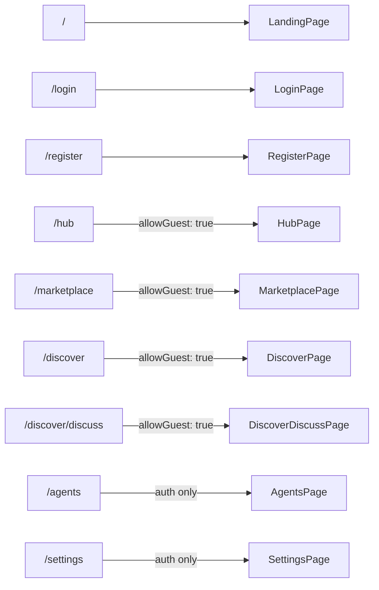

# Frontend Architecture

**Location:** `promptforge-client/`  
**Stack:** React 19, Vite, Zustand, React Router DOM v7, TailwindCSS v4, Axios, Framer Motion

---

## Entry Points

```
src/main.jsx        → mounts <App /> into #root
src/App.jsx         → route table, auth guards, store hydration hooks
```

---

## Routing

All routes are defined in `App.jsx`. The `AuthGuard` component enforces access.



### AuthGuard Behavior

- If `allowGuest: true`: guests and authenticated users are both permitted
- If auth-only: unauthenticated users are redirected to `/login`
- Reads from `authStore.isAuthenticated` and `authStore.isGuest`

---

## State Management

See [state-management.md](state-management.md) for full details.

| Store | File | Responsibility |
|---|---|---|
| `authStore` | `src/store/authStore.js` | Auth state, tokens, guest init, logout |
| `chatStore` | `src/store/chatStore.js` | Chat messages, model selection, session |
| `promptStore` | `src/store/promptStore.js` | Multi-step prompt builder |
| `modelStore` | `src/store/modelStore.js` | Model list, filters, recommendations |
| `tokenStore` | `src/store/tokenStore.js` | Token usage statistics |
| `languageStore` | `src/store/languageStore.js` | Locale selection |

---

## Services Layer

All services wrap Axios calls to the backend. The shared Axios instance lives in `src/services/api.js`.

```
src/services/
  api.js              → Axios instance, interceptors (auth header, 401 refresh)
  authService.js      → register, login, logout, guest init, token refresh, me
  sessionService.js   → load, merge, save sessions
  promptService.js    → generate, regenerate, update, remove, history
  modelService.js     → list, detail, labs, trending, featured, recommend, compare
  agentsService.js    → CRUD, templates, respond
  tokenManager.js     → in-memory token storage, refresh/failure handlers
  discoverService.js  → filters, feed, item
```

### Axios Interceptors (`api.js`)

**Request:** Attaches `Authorization: Bearer {accessToken}` to all non-auth routes.

**Response:** On 401, calls `tokenManager.refresh()`, retries the original request once. If refresh fails, calls `tokenManager.onFailure()` which triggers `authStore.logout()`.

---

## Hooks

### `useSession` (`src/hooks/useSession.js`)

Runs once on app mount. Bootstraps the full session:

```
1. Read localStorage pf_auth
2. If found → verify with GET /auth/me
3. If expired → try POST /auth/refresh
4. If no auth → read sessionStorage pf_guest
5. If no guest → POST /auth/guest (create new guest)
6. Mark hasBootstrapped: true in authStore
7. Hydrate chatStore + promptStore from backend session
```

Returns `{ isReady }`. `App.jsx` waits for `isReady` before rendering routes.

### `usePersist` (`src/hooks/usePersist.js`)

Wires a Zustand store to browser storage with TTL:
- Auth user → `localStorage`, key: `pf_auth`
- Guest → `sessionStorage`, key: `pf_guest`
- Chat → `sessionStorage`, key: `pf_chat_user:{userId}` or `pf_chat_guest:{sessionId}`
- Prompts → `localStorage`, key: `pf_prompt_{prefix}`
- Tokens → dynamic key `pf_tokens_{prefix}`

---

## Component Structure

```
src/components/
  auth/
    AuthGuard.jsx         → route protection wrapper
    LoginForm.jsx
    RegisterForm.jsx
    AuthQuotePanel.jsx
  chat/
    ChatWindow.jsx         → message list
    MessageBubble.jsx      → single message
    ModelSelector.jsx      → model switcher dropdown
    TokenBadge.jsx         → token count display
    GuidedAgentFlow.jsx    → agent-builder guided chat flow
  models/
    ModelGrid.jsx
    ModelCard.jsx
    ModelDrawer.jsx        → full model detail sheet
    CompareModal.jsx
  prompts/
    PromptBuilderFlow.jsx  → multi-step builder
    PromptCard.jsx
    StepCard.jsx
  agents/
    AgentBuilderFlow.jsx
    AgentTemplateCard.jsx
    ActionComposer.jsx
  stats/
    TokenStatsPanel.jsx
    AgentActivityLog.jsx
  ui/
    Button.jsx, Input.jsx, Card.jsx, Modal.jsx
    Badge.jsx, Toast.jsx, Skeleton.jsx, TypewriterText.jsx
  layout/
    Navbar.jsx
    PageWrapper.jsx
    Sidebar.jsx
```

---

## Pages

| Page | Route | Auth |
|---|---|---|
| `LandingPage.jsx` | `/` | Public |
| `LoginPage.jsx` | `/login` | Public |
| `RegisterPage.jsx` | `/register` | Public |
| `HubPage.jsx` | `/hub` | Guest OK |
| `MarketplacePage.jsx` | `/marketplace` | Guest OK |
| `AgentsPage.jsx` | `/agents` | Auth only |
| `DiscoverPage.jsx` | `/discover` | Guest OK |
| `DiscoverDiscussPage.jsx` | `/discover/discuss` | Guest OK |
| `SettingsPage.jsx` | `/settings` | Auth only |

---

## Data Files (Static / Fallback)

```
src/data/
  models.json             → client-side model fallback
  templates.json          → prompt templates
  agent-templates.json    → agent templates with icons
  fallbackData.js         → offline mode defaults
  discoverFeed.js         → static research feed content
  i18n.js                 → internationalization strings
```

---

## Utilities

```
src/utils/
  tokenCounter.js   → estimates tokens: text.length / 4
  sessionId.js      → generates guest session IDs
  mediaInput.js     → file upload handling for chat
```

---

## Build & Dev

```bash
# Development (port 5173)
cd promptforge-client && npm run dev

# Production build
cd promptforge-client && npm run build

# Preview production build
cd promptforge-client && npm run preview
```

Environment variable required: `VITE_API_URL` — see [environment.md](environment.md).

---

## Known Patterns & Gotchas

- **HMR / white screen after navigation** — Usually caused by stale Zustand action references. Check that stores are accessed via `useStore` selectors, not destructured at the module level.
- **Route works before refresh but not after** — Check storage hydration in `usePersist` and `useSession`. The issue is almost always in the bootstrap flow.
- **Guest-to-auth state bleed** — When a guest logs in, `sessionStorage` must be cleared and `localStorage` populated. The merge happens in `authStore.login()` + `sessionService.merge()`.
- **File uploads** — The composer sends multipart `FormData` only when files are attached. If no files, it sends JSON. The backend handles both.
