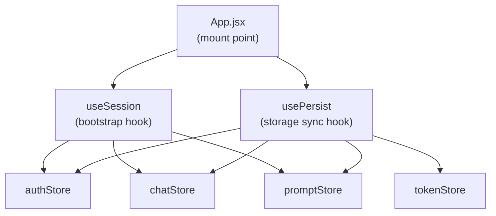

# State Management

PromptForge uses **Zustand** for all client-side state. Each domain has its own store. Stores are persisted to browser storage via the `usePersist` hook.

---

## Store Architecture



---

## authStore (`src/store/authStore.js`)

### State Shape

```js
{
  user: null,           // { id, name, email, role, preferences } | null
  isGuest: false,
  hasBootstrapped: false,
  sessionId: null,
  accessToken: null,
  refreshToken: null,
  isAuthenticated: false,
  isLoading: false,
  error: null,
}
```

### Key Actions

| Action | Description |
|---|---|
| `bootstrap(snapshot)` | Hydrates store from storage on app load |
| `login(email, password)` | Calls authService.login, stores tokens |
| `register(name, email, password, confirm)` | Calls authService.register |
| `logout({ reinitializeGuest?, silent? })` | Clears auth, optionally reinits guest |
| `initGuestSession()` | Calls POST /auth/guest |
| `refreshToken(silent?)` | Silently refreshes the access token |
| `clearError()` | Resets the error field |

### Persistence

- **Authenticated user:** `localStorage` key `pf_auth`
- **Guest:** `sessionStorage` key `pf_guest`

---

## chatStore (`src/store/chatStore.js`)

### State Shape

```js
{
  messages: [],
  activeModel: 'gpt-4o',
  modelHistory: [],
  sessionId: null,
  isTyping: false,
  isSwitching: false,
  pendingComposer: null,   // { content, files, autoSend }
  guideFlow: {
    mode: null,            // null | 'agent-builder'
    template: null,
    prompt: '',
    step: null,            // 'audience' | 'recommendations' | 'deep-dive'
    audience: null,
    selectedModelId: null,
    selectedQuestionId: null,
  }
}
```

### Key Actions

| Action | Description |
|---|---|
| `initSession(session)` | Sets sessionId and loads existing history |
| `loadHistory(sessionId)` | Fetches history from GET /chat/history |
| `sendMessage(payload)` | POST /chat/message, adds to messages |
| `switchModel(modelId)` | POST /chat/switch-model |
| `clearHistory()` | DELETE /chat/history |
| `startAgentGuide(payload?)` | Enters guided agent-builder flow |
| `hydrate(snapshot?)` | Re-hydrates from storage |

### Persistence

Dynamic key: `pf_chat_user:{userId}` (auth) or `pf_chat_guest:{sessionId}` (guest)  
TTL: 4 hours

---

## promptStore (`src/store/promptStore.js`)

### State Shape

```js
{
  currentStep: 0,          // 0–4 builder steps
  entryMessage: '',
  answers: {
    useCase: '',
    audience: '',
    experience: '',
    followUp: '',
  },
  generatedPrompt: null,   // { promptText, templateUsed, estimatedTokens, suggestedModels, promptId }
  promptHistory: [],
  isGenerating: false,
}
```

### Builder Steps

| Step | Field |
|---|---|
| 0 | Initial (useCase selection) |
| 1 | audience |
| 2 | experience |
| 3 | followUp |
| 4 | Result (generated prompt) |

### Key Actions

| Action | Description |
|---|---|
| `startFlow(useCase?, entryMessage?)` | Initializes builder |
| `nextStep()` / `prevStep()` | Navigate steps |
| `setAnswer(key, value)` | Set individual answer |
| `generatePrompt()` | POST /prompts/generate |
| `regeneratePrompt(promptId)` | POST /prompts/regenerate |
| `editPrompt(promptId, text)` | PUT /prompts/{id} |
| `deletePrompt(promptId)` | DELETE /prompts/{id} |
| `reset()` | Clear all builder state |

### Persistence

`localStorage` key: `pf_prompt_{prefix}` (prefix varies by user/guest)

---

## modelStore (`src/store/modelStore.js`)

### State Shape

```js
{
  allModels: [],
  selectedModel: null,
  recommendedModels: [],
  filters: {
    categories: [],
    labs: [],
    maxPrice: Infinity,
    minRating: 0,
  },
  isLoadingModels: false,
}
```

### Key Actions

| Action | Description |
|---|---|
| `fetchModels(filters?)` | GET /models with current filters |
| `selectModel(model)` | Set active model for drawer/compare |
| `compareModels(ids)` | GET /models/compare |
| `recommend(answers)` | POST /models/recommend |
| `applyFilter(name, value)` | Update a filter field |
| `resetFilters()` | Clear all filters |

No persistence — reloads from API on each session.

---

## tokenStore (`src/store/tokenStore.js`)

### State Shape

```js
{
  sessionTokens: {
    totalTokens: 0,
    totalCost: 0,
    byAgent: {},
  },
  userTokens: null,
  stats: [],
}
```

### Key Actions

| Action | Description |
|---|---|
| `loadSession(sessionId)` | GET /tokens/session/{id} |
| `loadUser()` | GET /tokens/user/{userId} |
| `reset()` | Clear token stats |

### Persistence

Dynamic key: `pf_tokens_{prefix}`

---

## languageStore (`src/store/languageStore.js`)

Simple store. State: `{ locale: 'en' }`. Action: `setLocale(locale)`.

---

## Common Patterns

### Accessing a store

```js
// Correct — selector pattern (avoids unnecessary re-renders)
const user = useAuthStore(state => state.user);
const login = useAuthStore(state => state.login);

// Avoid — subscribes to entire store
const { user, login } = useAuthStore();
```

### Pitfalls

- **Stale closures in HMR** — During hot reload, closures over store actions can become stale. Always call actions through the store selector, not a captured reference.
- **Cross-store reads** — Some actions in `chatStore` read from `authStore` (e.g. to get `sessionId`). This is done via direct import of the store's `getState()`, not via React hooks, to avoid circular dependencies.
- **Storage key collision** — Guest and user keys differ by prefix. If a guest logs in and the keys are not migrated, the new auth session will start empty. This is handled in `authStore.login()`.
